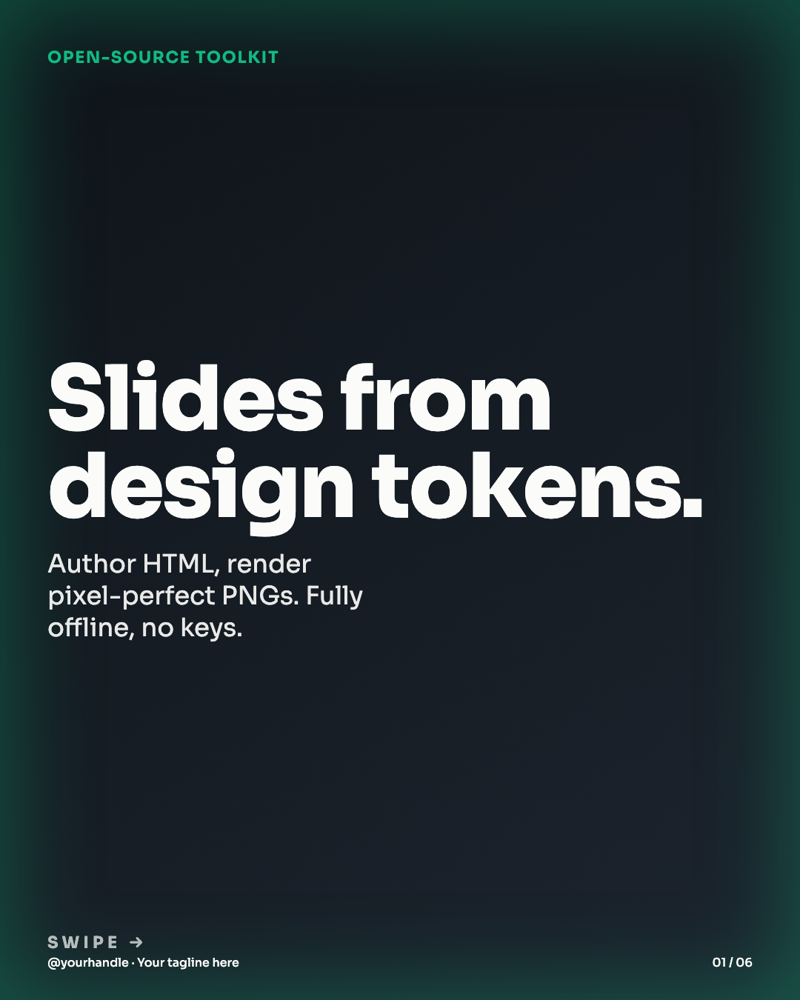
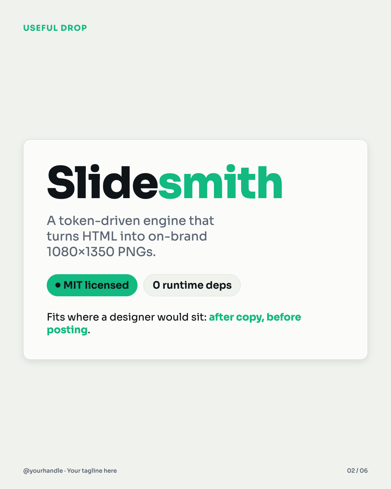
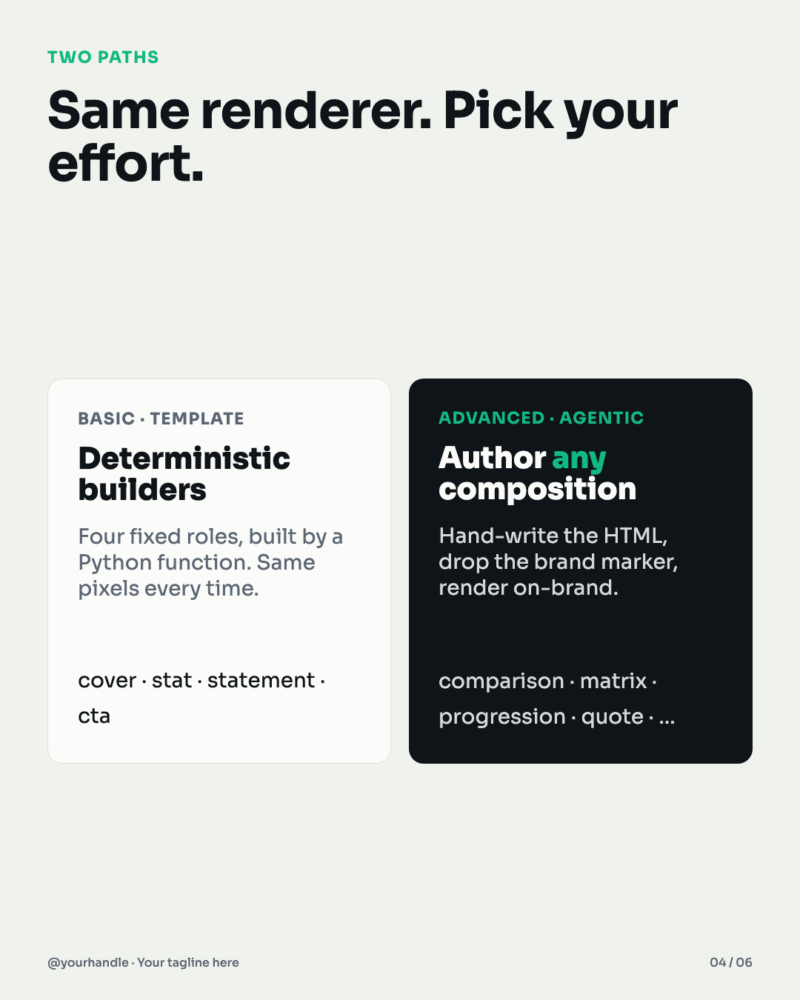
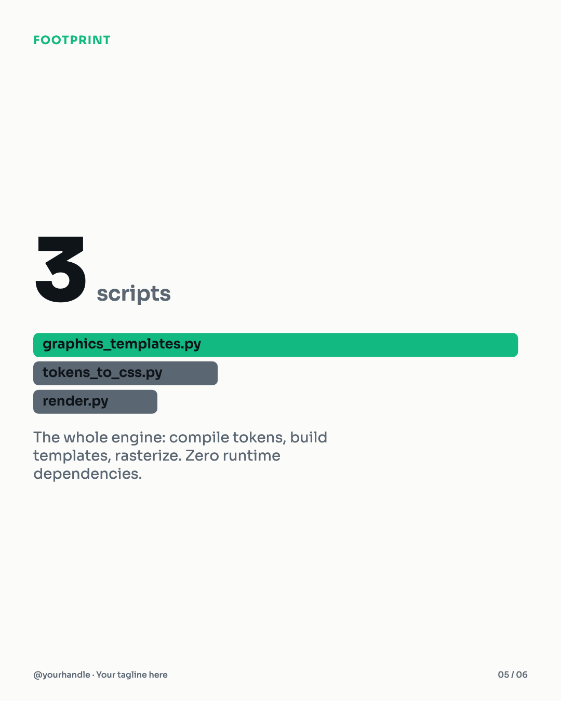

# Slidesmith

*by Theo Popov*

**Turn design tokens + HTML into pixel-perfect, on-brand social slides — fully offline, no API keys.**

Slidesmith is a tiny, dependency-free engine for rendering 1080×1350 (4:5) or 1080×1080 (1:1) social
graphics. You define your brand once as **design tokens**; every slide then references those tokens as
CSS variables, so a whole carousel stays on-brand by construction. Rendering is done by headless
Chrome — no cloud service, no fonts or scripts fetched over the network.

It ships two ways to make a slide:

- **Basic path — deterministic templates.** Four fixed roles (`cover`, `stat`, `statement`, `cta`)
  built by a Python function. Same input → same pixels, every time.
- **Advanced path — agentic authoring** *(the default, and the interesting one)*. You author a slide
  as a small HTML file using your tokens (`var(--…)`) and a one-line `/*@BRAND_CSS@*/` marker; the
  renderer injects the compiled design system at render time. This unlocks the full range of
  compositions — `comparison`, `matrix`, `progression`, `myth_reframe`, `stack_diagram`,
  `useful_drop`, `quote`, and anything else you can express in HTML/CSS/SVG — while staying locked to
  your brand tokens. See [`docs/ART-DIRECTION.md`](docs/ART-DIRECTION.md).

Both paths render through the same command and produce the same kind of PNG.

---

## What it produces

A 6-slide demo carousel (rendered by `make demo`) and a layout gallery live in
[`examples/expected/`](examples/expected/). A few frames:

| Cover (template) | Useful-drop (agentic) | Two-path comparison (agentic) | Stat + ECharts (template) |
|---|---|---|---|
|  |  |  |  |

The gallery also covers `progression`, `matrix`, `myth_reframe`, `problem_solution`, `steps`, `list`,
and `quote` — see [`examples/expected/`](examples/expected/).

---

## Prerequisites

- **Python 3.9+** (standard library only — there is nothing to `pip install`).
- **Google Chrome or Chromium** for headless rasterization. Slidesmith defaults to the macOS Chrome
  path; on Linux/Windows or for Chromium, set `CHROME_BIN` (see [`.env.example`](.env.example)):

  ```bash
  export CHROME_BIN=/usr/bin/google-chrome      # Linux example
  # export CHROME_BIN=/usr/bin/chromium
  ```

No other native binaries, no font packages to install — the **Sora** typeface is bundled and embedded
into the compiled stylesheet, and **Apache ECharts** is bundled locally.

---

## Quickstart

```bash
git clone <this-repo> slidesmith && cd slidesmith

# 1. Compile your design tokens into the brand stylesheet
make css                     # -> design/brand.css

# 2. Render the demo carousel (basic + advanced paths together)
make demo                    # -> out/demo/slide_1.png … slide_6.png

# 3. (optional) regenerate the committed reference gallery
make examples                # -> examples/expected/*.png
```

Render a single slide directly:

```bash
# Advanced path: author HTML (see docs/ART-DIRECTION.md), then rasterize with brand injection
python engine/render.py my_slide.html my_slide.png --size 1080,1350 --brand-css design/brand.css

# Basic path: build a template slide from a small JSON of copy fields
python engine/graphics_templates.py cover examples/copy/cover.json cover.html --size 1080,1350 --pager "01 / 06"
python engine/render.py cover.html cover.png --size 1080,1350 --brand-css design/brand.css
```

---

## How it works

```
design/tokens.json ──(engine/tokens_to_css.py)──▶ design/brand.css   # your brand, as CSS variables
                                                        │
        ┌───────────────────────────────────────────────┤
        │ basic path                                     │ advanced path
        ▼                                                ▼
engine/graphics_templates.py                    you author  <slide>.html
  cover / stat / statement / cta                  ( /*@BRAND_CSS@*/ + var(--…) )
        │                                                │
        └───────────────▶  engine/render.py  ◀───────────┘
                     (headless Chrome, --brand-css injection)
                                 │
                                 ▼
                          1080×1350 PNG
```

- **`engine/tokens_to_css.py`** compiles `design/tokens.json` (primitives → light mode → semantic)
  into `design/brand.css`: every token becomes a CSS custom property, and the Sora font is embedded
  as a base64 `@font-face` so slides are self-contained.
- **`engine/graphics_templates.py`** builds the four stable roles deterministically. The `stat`
  builder can embed a **real ECharts bar chart** (colors resolved from your tokens by semantic role).
- **`engine/render.py`** rasterizes any HTML to PNG. If the HTML contains the `/*@BRAND_CSS@*/`
  marker and you pass `--brand-css design/brand.css`, the compiled design system is injected at that
  marker — this is the mechanism behind the advanced path.

The **planning/authoring method** (how many slides, which layout per beat, the authoring contract) is
documented in [`docs/`](docs/) and driven optionally by
[`.claude/commands/graphics.md`](.claude/commands/graphics.md).

---

## Configuration reference

Everything brand-specific lives in **data**, not code:

| File | What it controls |
|---|---|
| `design/tokens.json` | Your entire theme — colors, type scale, spacing, radii, shadows. Edit → `make css` re-themes every slide. |
| `design/brand.json` | The footer mark (`handle` + `tagline`). Set both to `""` for no mark. |
| `design/graphics-format-library.json` | Frames: aspect ratio, pixel size, slide roles, allowed layouts. |
| `design/slide-layout-library.json` | The layout vocabulary and its `template` / `agentic` render routing. |
| `CHROME_BIN` (env) | Path to your Chrome/Chromium binary. See `.env.example`. |

There are **no secrets, API keys, or accounts** anywhere in Slidesmith.

---

## Re-theming

Change the values in `design/tokens.json` and run `make css`. Because every slide references
`var(--token)` rather than hardcoded colors, the entire deck re-skins at once — the same source of
truth drives templates and agentic slides alike. To change the typeface, replace
`engine/assets/Sora.ttf`, update the `font.family.*` tokens, and update `THIRD_PARTY_NOTICES.md`.

---

## License

Slidesmith's source code is [MIT](LICENSE). Bundled third-party assets keep their own licenses:
**Sora** (SIL Open Font License 1.1) and **Apache ECharts** (Apache License 2.0). See
[`THIRD_PARTY_NOTICES.md`](THIRD_PARTY_NOTICES.md).
